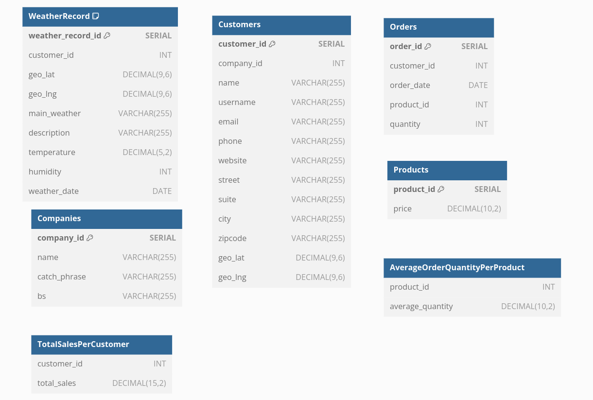

# Comprehensive Sales Data Pipeline

This repository contains the implementation of a comprehensive sales data pipeline for a retail company. The pipeline integrates sales data with user information and weather data, performs necessary transformations and aggregations, and stores the final dataset in a relational database for further analysis.

## Table of Contents
- [Project Structure](#project-structure)
- [Getting Started](#getting-started)
  - [Prerequisites](#prerequisites)
  - [Installation](#installation)
  - [Usage](#usage)
- [Data Transformation,Manipulation and Aggregations](#data-transformation)
- [Data Storage](#data-storage)


# Project Structure
```plaintext
/task/
|-- src/
|   |-- main.py            # Main script to run the data pipeline
|   |-- extraction.py      # Modules to handle API requests
|   |-- transformation.py      # Modules for data transformation
|   |-- database_manager.py      # Modules for database operations
|   `-- db/                # Folder for database schema image 
|-- config/
|   |-- config.json            # All project configuration
|-- outputs/             # All project outputs
|-- Dockerfile             # Dockerfile for creating a containerized version
|-- requirements.txt       # The dependencies for the project
`-- README.md              # Documentation for the project
```

# Getting Started
## Prerequisites
- you need to create folder data/ inside task/ containing sales data csv.
- You will also need to create API key for OpenWeatherMap.

## Installation

### Using Python

1. Ensure that Python version 3.10.12 is installed on your system. You can download it from the [official Python website](https://www.python.org/downloads/).
2. Install pip, Python's package installer, if it's not already installed.
3. Navigate to the root directory of the project and install the required dependencies with the following command:

```bash
pip install -r requirements.txt
```

### Using Docker

Alternatively, if you prefer to use Docker, build the Docker image with the following command:

```bash
docker build -t sales-data-pipeline .
```

This command creates a Docker image named sales-data-pipeline, encapsulating all the necessary dependencies.


## Usage

- After installation, you can run the data pipeline using one of two methods:
- Create outputs/ folder to store all output on the same level as /task/


### Running Natively

```bash
cd src/

python3 main.py
```

### Running in Docker

- replace /home/workspace/task/outputs with your absoulte outputs/ path
```bash
docker run -v /home/workspace/task/outputs:/app/outputs/ -it sales-data-pipeline
```

## Data Transformation

### Transformation Class

#### Preparing Customer Data
Customer information is extracted and normalized from the enriched sales data. It assumes that user data is embedded within the sales data DataFrame as dictionaries and that all necessary user fields are present.

#### Preparing Product Data
Product information is extracted, ensuring no duplicate `product_id` entries. It assumes that product IDs are unique and that the first occurrence of each product ID has the correct price.

#### Preparing Orders Data
Order information is extracted without duplication. This step assumes that the sales data includes all necessary order details.

#### Preparing Company Data
Company information is extracted from the user data. This assumes that each user's company information is correctly formatted and present.

#### Preparing Weather Data
Weather data is prepared by extracting and normalizing relevant details from the weather data associated with each sale. It assumes weather data is present for all sales and that the structure of the weather data is consistent.

#### Calculating Total Sales Per Customer
Total sales per customer are calculated by summing up the sales amounts (quantity multiplied by price) for each customer. This assumes that each sale includes a valid customer ID, quantity, and price.

#### Determining Average Order Quantity Per Product
The average order quantity for each product is calculated. This assumes that sales data includes a valid `product_id` and `quantity` for each sale.

#### Identifying Top Selling Products or Customers
This identifies the products and customers with the highest sales and assumes that sales data includes accurate `product_id`, `customer_id`, and sales amount information.

#### Analyzing Sales Trends Over Time
Sales trends are analyzed by summing sales amounts per month, assuming that sales data includes accurate `order_date` and `sales_amount` information.

#### Including Weather Data in Analysis
The average sales amount per weather condition is calculated, assuming that the weather data has been correctly parsed and associated with each sale.

## Data Storage



### Database Description

#### WeatherRecord
- `weather_record_id` (SERIAL): A unique identifier for each weather record.
- `customer_id` (INT): The ID of the customer associated with the weather record.
- `geo_lat` (DECIMAL(9,6)): The geographic latitude where the weather record was taken.
- `geo_lng` (DECIMAL(9,6)): The geographic longitude where the weather record was taken.
- `main_weather` (VARCHAR(255)): The main weather conditions.
- `description` (VARCHAR(255)): A description of the weather conditions.
- `temperature` (DECIMAL(5,2)): The recorded temperature.
- `humidity` (INT): The recorded humidity.
- `weather_date` (DATE): The date when the weather record was taken.

#### Companies
- `company_id` (SERIAL): A unique identifier for each company.
- `name` (VARCHAR(255)): The name of the company.
- `catch_phrase` (VARCHAR(255)): The catchphrase of the company.
- `bs` (VARCHAR(255)): The 'bs' field, which could stand for business slogan or similar.

#### Customers
- `customer_id` (SERIAL): A unique identifier for each customer.
- `company_id` (INT): The ID of the company associated with the customer.
- `name` (VARCHAR(255)): The name of the customer.
- `username` (VARCHAR(255)): The customer's username.
- `email` (VARCHAR(255)): The customer's email address.
- `phone` (VARCHAR(255)): The customer's phone number.
- `website` (VARCHAR(255)): The customer's website.
- `street` (VARCHAR(255)): The customer's street address.
- `suite` (VARCHAR(255)): Additional address details for the customer.
- `city` (VARCHAR(255)): The city of the customer's address.
- `zipcode` (VARCHAR(255)): The postal code of the customer's address.
- `geo_lat` (DECIMAL(9,6)): The latitude of the customer's location.
- `geo_lng` (DECIMAL(9,6)): The longitude of the customer's location.

#### Orders
- `order_id` (SERIAL): A unique identifier for each order.
- `customer_id` (INT): The ID of the customer who placed the order.
- `order_date` (DATE): The date the order was placed.
- `product_id` (INT): The ID of the product ordered.
- `quantity` (INT): The quantity of the product ordered.

#### Products
- `product_id` (SERIAL): A unique identifier for each product.
- `price` (DECIMAL(10,2)): The price of the product.

#### TotalSalesPerCustomer
- `customer_id` (INT): The ID of the customer.
- `total_sales` (DECIMAL(15,2)): The total sales amount associated with the customer.

#### AverageOrderQuantityPerProduct
- `product_id` (INT): The ID of the product.
- `average_quantity` (DECIMAL(10,2)): The average quantity of the product ordered.

Each `customer_id`, `company_id`, `product_id`, and `weather_record_id` fields are primary keys in their respective tables. The schema shows relationships between tables, such as Customers related to Companies via `company_id`, and Orders related to Customers and Products via `customer_id` and `product_id`, respectively.
